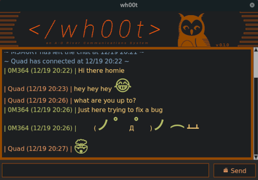

<h1 align="center">wh00t_client</h1>

<div align="center">
	
</div>

## About
Simple python LAN chat client app with emoji support. `wh00t_client` functions as part of the larger `wh00t` project. This particular repository's purpose is
to act as a chat client.

<div align="center">
	
</div>


## Install

- Libraries needed for Linux (tested on Fedora 34):

    ```
    sudo dnf install cairo-devel pkg-config python3-devel gobject-introspection-devel libjpeg-devel openjpeg2-devel cairo-gobject-devel python3-tkinter
    ```

This project is managed with [Poetry](https://github.com/python-poetry/poetry). With Poetry installed correctly, simply clone this project and install its dependencies:
- Clone repo
    ```
    git clone https://github.com/roboto84/wh00t_client.git
    ```
    ```
    cd wh00t_client
    ```
- Install dependencies
    ```
    poetry install
    ```

## Environmental Variables
This process functions as the wh00t chat client. `wh00t_client.py` requires that an `.env` file is available in the *same* directory it is running under.

- The format of the `.env` file should contain the following as defined environmental variables:
    - `CLIENT_USER_NAME` : Your chosen username.
    - `SERVER_ADDRESS` : The chat server address.
    - `SERVER_PORT` : The port the chat server is listening on.

- An explained `.env` file format is shown below:
    ```
    CLIENT_USER_NAME=<Username>
    SERVER_ADDRESS=<Server address>
    SERVER_PORT=<Server port>
    ```

- A typical `.env` file may look like this:
    ```
    CLIENT_USER_NAME=ChillHopper
    SERVER_ADDRESS=192.168.0.102
    SERVER_PORT=3001
    ```

- Optional environmental variables are:
    - `DEBUG` : boolean value (`true` or `false`) which causes client to show extra debug information


## Usage
- Run the script once the environment file `.env` is created:
    ```
    poetry run python wh00t_client/wh00t_client.py
    ```

To exit the client, simply hit the close button on the client window, or type the exit command (`/exit`) into
the message input field and hit send.

## Client Options

### Commands

The client supports an array of commands that do not get sent over as a message, but instead gives the user feedback and help information.  The following commands can be used:

| Command            | Description
|--------------------|-------------
| `/help`            | prints this help summary
| `/version`         | outputs `wh00t` client version
| `/sound`           | turn notification sounds on
| `/noSound`         | turn notification sounds off
| `/notify`          | turn notification toast on
| `/noNotification`  | turn notification toast off
| `/emojis`          | print list of top used emojis
| `/meme {memeName}` | sends specific meme as a message. See `/memes`
| `/memes`           | prints out a list of available meme commands
| `/secret`          | a prefixing message command that marks the message it prefixes for 60 sec self destruction
| `/exit`            | exits program


### Keyboard Mappings

When the message input field is selected, the following keyboard bindings are in effect:

| Key | Description
|-----|-------------
| `UpKey` | will allow you to go through your message history and select it for editing and resending
| `DownKey` | will erase text currently in the message input field
| `PageUp` & ``PageDown`` | scroll, in the input message box, through a subset of quick support emojis shortcodes
| `EscKey` | print the ``exit_string`` command in the message input field

### Message Editing

The client supports an array of message editing options in order to enhance message context. The following options are available:

| Message | Description
|---------|-------------
| `:emoji_shortcodes:` | inline emoji shortcodes are supported
| `[message_in_brackets]` | accentuates portion of message within brackets with a larger font and custom coloring

### Emojis

A certain subset of emoji shortcodes are supported.  Emoji shortcodes can be researched at [emojipedia](https://emojipedia.org/shortcodes/).  The following are examples of phrases with emoji shortcodes:
```
Hi there :smile:, How are you today?
Doing great, :thumbsup:
Hey, :thinking_face: I have a question for you...
```

Which would produce:
```
Hi there 😄, how are you today?
Doing great, 👍
Hey, 🤔 I have a question for you...
```

You can scroll, in the input message box, through a subset of quick support emoji shortcodes to inject into
your messages by using the `PageUp` and `PageDown` keys on the keyboard.

## Commit Conventions
Git commits follow [Conventional Commits](https://www.conventionalcommits.org) message style as explained in detail on their website.

<br/>
<sup>
    <a href="https://www.flaticon.com/free-icons/owl" title="owl icon">
        wh00t_server icon created by Freepik - Flaticon
    </a>
</sup>

